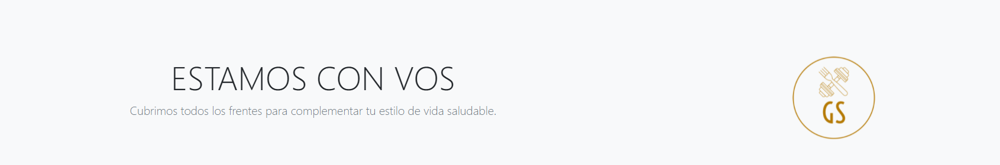

<h1 align="center">Gold Standard Nutrition</h1>

<h2 align="center"> Proyecto Final - Coder Javascript Comisión 31640 - David Victoria </h2>

<!-- SOBRE -->
## Acerca del proyecto

<!-- DESCRIPCION -->
Gold Standard Nutrition o **GS Nutrition** es una empresa ficticia que ofrece productos y servicios relacionados a la salud, deporte y recuperación física tales como `suplementos`, `vitaminas`, `comidas y bebidas`, `ropa deportiva`, `pesas y equipamiento de gym`y `entrenamiento personalizado/grupal`.
También incluye un sistema de membresía con pago mensual para disfrutar ciertos beneficios premium, tales como son descriptos en "Descubrinos".

Los tres archivos JS son para ejecutar la funcionalidad de simular un inicio de sesión, donde el almacenamiento del usuario pasa a ser el localstorage. Al registrarse, el usuario recibe un e-mail a través del API emailJS, el cual también se ejecuta en newsletter.js al suscribirse.

<!-- Herramientas -->

### Herramientas / Plugins Utilizados

* Visual Studio
* Javascript
* SweetAlert2
* HTML
* CSS/SASS
* Bootstrap
* MDB
* Google Fonts
* GitBash / GitHub
* Canva
* Adobe Photoshop
* Google Chrome

<!-- CONTACTO -->
## Contacto

[David Victoria](https://twitter.com/FlorealV) - df.victoria@outlook.com

Proyecto: [https://dfvictoria.github.io/Proyecto-Final-JS/]
